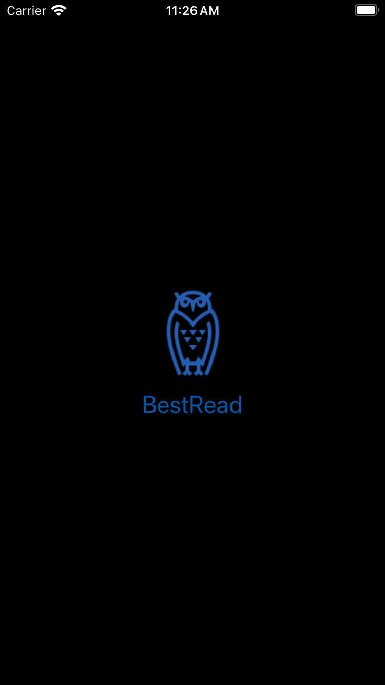
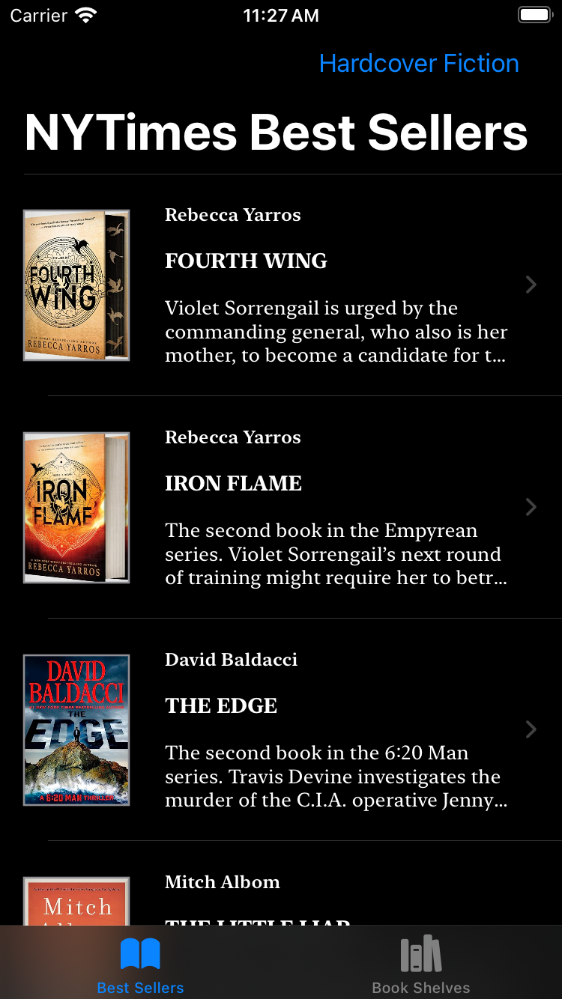
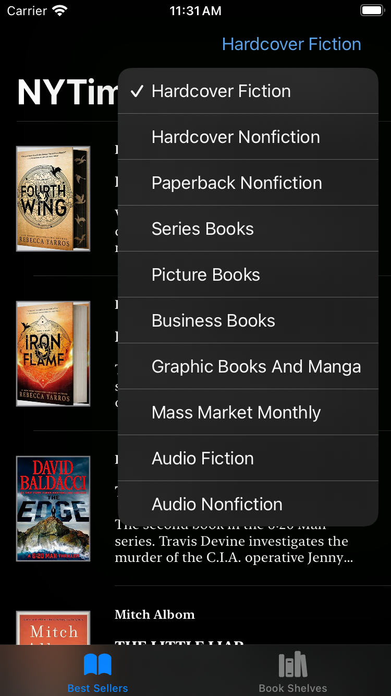
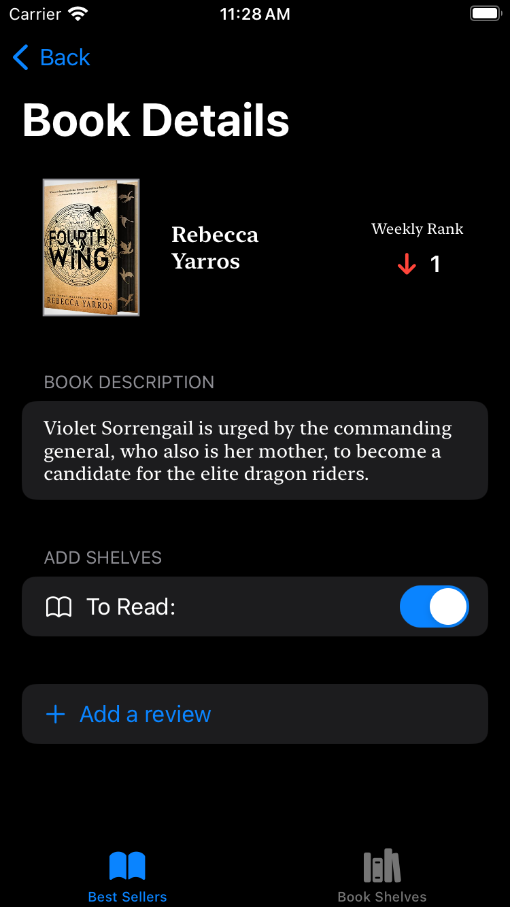
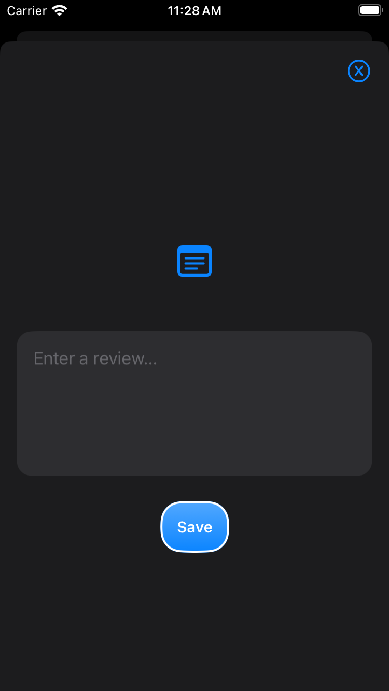
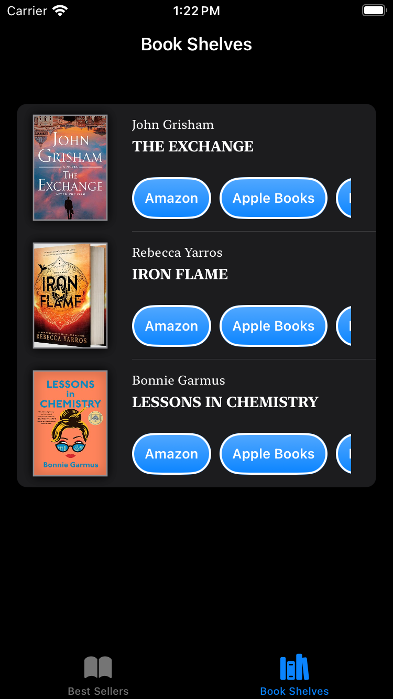
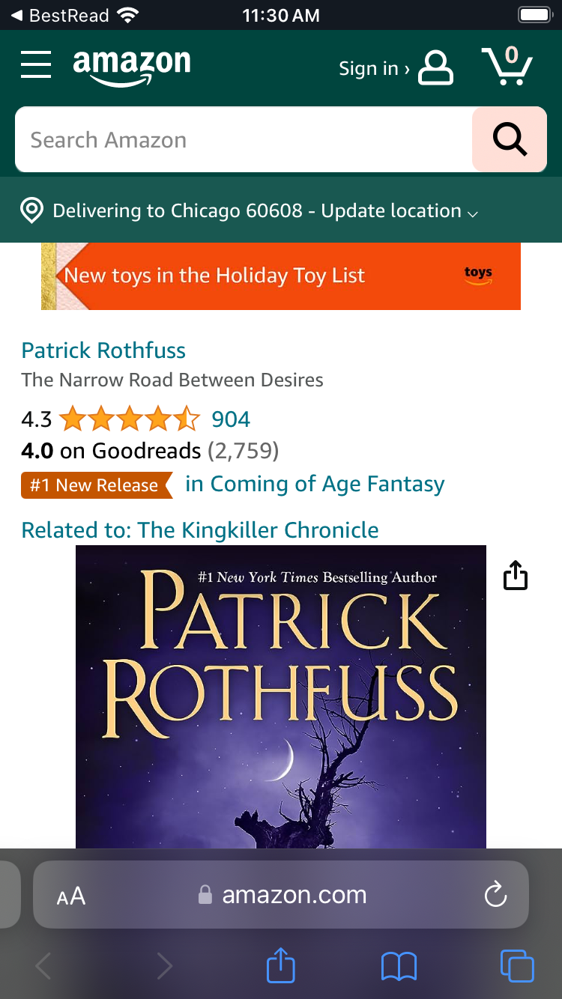

# BestRead Capstone Project

* Xcode 17.0
* BestRead app displays best seller books from NY Times API.

## App Introduction
* BestRead is an iOS application that fetches NYTimes book lists api and displays best seller books for the current week. It includes book details along with saving them into book shelves. User is also able to add reviews for the books and find buying links.

## Concepts & Used Features
* SwiftUI with @State, @StateObject, @Binding, @Environment, @ObservedObject, @MainActor
* MVVM design pattern.
* Launch screen with animation.
* Navigation stack, list view, form view.
* Modern Concurrency.
* URLSession, async, await, MainActor for main and background threads.
* Error Handling for network calls and server errors.
* Saving data with FileManager and Property List.
* Portrait and Landscape orientations and compatible to full range of iPhone sizes.
* Light and Dark mode compatible.
* Developed following MVVM pattern.
* Swiftlint for Swift style.
* Includes Unit and UI tests.
* Custom icon, onboarding screen.
* Styled text properties, custom view modifiers, extracted views.

## Screenshots

